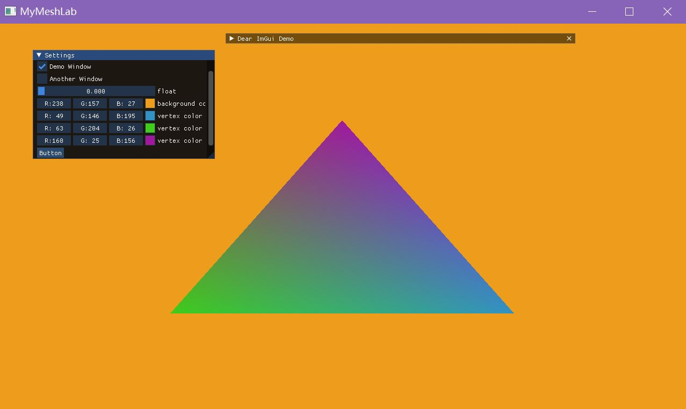

之前使用USTC的框架来进行Mesh相关算法的实现，虽然因为课程的关系比较熟悉，但是在写参数化之外的算法时，相比如GCAL、libigl等常见算法库，面临手册信息没有、调bug痛苦的问题。

正好自己最近也在学习开源项目，因此计划自己写一个，计划利用CGAL作为主体，使用opengl+imgui作为前端，利用xmake构建（超赞！！人生苦短，我选xmake）


在这里[Releases · xmake](https://github.com/xmake-io/xmake/releases)下载xmake

目前暂时不支持Linux（虽然跨平台实现是挺方便的，但是时间...）

构建

```
xmake
```

运行

```
xmake run MyLab
```


Tips：

在编写代码时，为了能代码补全相关的库函数，运行

```
xmake project -k compile_commands
```

然后右键该`compile_commands.json`文件选择`load ...`，就会像python一样导包了，享受到和之前一样的代码提示、自动补全，好耶！！


项目进度：

2023/4/24 [sayoriaaa/MyMeshLab at c36ce5c392f10a6a080b4f8395080a099da6b43d (github.com)](https://github.com/sayoriaaa/MyMeshLab/tree/c36ce5c392f10a6a080b4f8395080a099da6b43d)

- 实现基于xmake的基本imgui页面搭建
- 实现obj文件的读入

2023/4/26

- 完成基础渲染管线搭建

- 实现小demo （扩展自[你好，三角形 - LearnOpenGL CN (learnopengl-cn.github.io)](https://learnopengl-cn.github.io/01 Getting started/04 Hello Triangle/)）



内嵌shader版 [sayoriaaa/MyMeshLab at 725626e3f2440f9906ed985daedaafe8288015b3 (github.com)](https://github.com/sayoriaaa/MyMeshLab/tree/725626e3f2440f9906ed985daedaafe8288015b3)

clean code版 [sayoriaaa/MyMeshLab at c427a15ab01346a0c5a501577f10ea56b09cda7f (github.com)](https://github.com/sayoriaaa/MyMeshLab/tree/c427a15ab01346a0c5a501577f10ea56b09cda7f)

四边形版 [sayoriaaa/MyMeshLab at 955046e63e624f748f56050fd510aa5d5c704011 (github.com)](https://github.com/sayoriaaa/MyMeshLab/tree/955046e63e624f748f56050fd510aa5d5c704011)


参考相关项目

基于xmake的创建imgui示例页面 [xmake-examples/imgui-scaffold: A minimal imgui project template (github.com)](https://github.com/xmake-examples/imgui-scaffold)

读取obj文件 [xianzhongfang/topocut: Open source code for SIGGRAPH 2022 journal paper TopoCut. (github.com)](https://github.com/xianzhongfang/topocut)

参考资料

[OPENFILENAMEW (commdlg.h) - Win32 apps | Microsoft Learn](https://learn.microsoft.com/zh-cn/windows/win32/api/commdlg/ns-commdlg-openfilenamew)