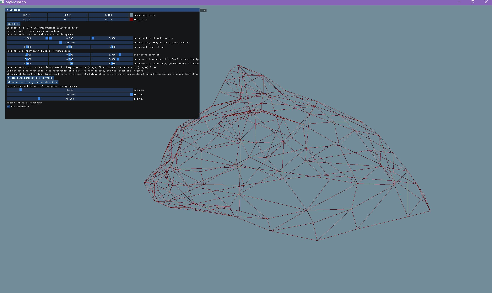

## 项目说明

之前使用[USTC的框架](http://staff.ustc.edu.cn/~fuxm/code/index.html#sec_surface_framework)来进行Mesh相关算法的实现，但是自己想实现参数化之外的算法时，相比如GCAL、libigl等常见算法库，面临手册信息没有、调bug痛苦的问题。

正好自己最近也在学习开源项目的开发，因此计划自己写一个使用opengl+imgui作为前端的算法框架（CGAL自带的可视化和USTC的框架一样也是Qt，我还是想自己再走一遍），然后用自己的这个来实现相关算法的学习和效果的呈现



## 编译构建

在这里[Releases · xmake](https://github.com/xmake-io/xmake/releases)下载xmake

目前暂时不支持Linux

构建

```
xmake
```

运行

```
xmake run MyLab
```


## 文件说明

header.h放置一些通用的头文件，随意调用不会冲突

mesh.h中的命名空间`mesh`存放导入的mesh顶点、面数据；mesh相关的算法；需要`io.h`

demo.h中放置不同demo调用不同shader的方式，在这里实现opengl直接相关的图像的绘制，同时需要接受来自imgui前端`front`的数据以及`mesh.h`中的模型数据，因此包含头文件

- \#include "header.h"
- \#include "front.h"
- \#include "shader/shader.h"
- \#include "mesh.h"

front.h包含imgui界面的显示，需要util.h来帮助调用windows系统的文件管理器，打开模型文件，导入到`mesh`空间中，同时设置一些camera参数，因此包含头文件

- \#include "camera.h"
- \#include "util.h"
- \#include "mesh.h"

shader.h中仅包含shader类

camera.h定义了mvp矩阵的计算（与具体的vertex shader联系）以及键盘操作对mvp矩阵的修改

io.h解析三维模型文件到vertices, indices，仅被mesh.h调用

## 参考相关项目

基于xmake的创建imgui示例页面 [xmake-examples/imgui-scaffold: A minimal imgui project template (github.com)](https://github.com/xmake-examples/imgui-scaffold)

读取obj文件 [xianzhongfang/topocut: Open source code for SIGGRAPH 2022 journal paper TopoCut. (github.com)](https://github.com/xianzhongfang/topocut)

## 参考资料

[主页 - LearnOpenGL CN (learnopengl-cn.github.io)](https://learnopengl-cn.github.io/)

[The Computational Geometry Algorithms Library (cgal.org)](https://www.cgal.org/)

[OPENFILENAMEW (commdlg.h) - Win32 apps | Microsoft Learn](https://learn.microsoft.com/zh-cn/windows/win32/api/commdlg/ns-commdlg-openfilenamew)

[CGAL 5.5.2 - Polygon Mesh Processing: User Manual](https://doc.cgal.org/latest/Polygon_mesh_processing/index.html#Chapter_PolygonMeshProcessing)

## 开发历史

2023/4/24 [sayoriaaa/MyMeshLab at c36ce5c392f10a6a080b4f8395080a099da6b43d (github.com)](https://github.com/sayoriaaa/MyMeshLab/tree/c36ce5c392f10a6a080b4f8395080a099da6b43d)

- 实现基于xmake的基本imgui页面搭建
- 实现obj文件的读入

2023/4/26 （学习opengl API）

- 完成基础渲染管线搭建

- 实现小demo （扩展自[你好，三角形 - LearnOpenGL CN (learnopengl-cn.github.io)](https://learnopengl-cn.github.io/01 Getting started/04 Hello Triangle/)）


内嵌shader版 [sayoriaaa/MyMeshLab at 725626e3f2440f9906ed985daedaafe8288015b3 (github.com)](https://github.com/sayoriaaa/MyMeshLab/tree/725626e3f2440f9906ed985daedaafe8288015b3)

clean code版 [sayoriaaa/MyMeshLab at c427a15ab01346a0c5a501577f10ea56b09cda7f (github.com)](https://github.com/sayoriaaa/MyMeshLab/tree/c427a15ab01346a0c5a501577f10ea56b09cda7f)

四边形版 [sayoriaaa/MyMeshLab at 955046e63e624f748f56050fd510aa5d5c704011 (github.com)](https://github.com/sayoriaaa/MyMeshLab/tree/955046e63e624f748f56050fd510aa5d5c704011)

由于opengl的鼠标操作会和imgui冲突，所以鼠标控制camera view舍弃，仅由imgui面板控制

2023/4/28

- 整理项目

2023/4/30

- 实现obj文件的基础显示


2023/5/3

- 将CGAL整合入

  


## Tips

在编写代码时，为了能代码补全相关的库函数，运行

```
xmake project -k compile_commands
```

然后右键该`compile_commands.json`文件选择`load ...`，就会像python一样导包了，享受到和之前一样的代码提示、自动补全，好耶！！


调用`glGenBuffers`会new 对象，所以在循环中使用时注意在下一次执行前delete掉

## TODO

- [ ] fix 打开大模型（面数1w+）时的内存错误
- [ ] fix 应用CGAL isotropic remeshing [CGAL 5.5.2 - Polygon Mesh Processing: Meshing](https://doc.cgal.org/latest/Polygon_mesh_processing/group__PMP__meshing__grp.html#gaa5cc92275df27f0baab2472ecbc4ea3f)结果错误


## 代码提交

```
git@github.com:sayoriaaa/MyMeshLab.git
```

